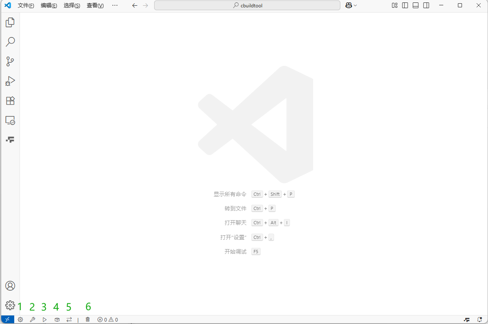

# cbuild

[中文文档](README_zhCN.md)

This repository provides a lightweight build workflow for C/C++ projects, with optional VSCode integration and Conan support.

## Table of Contents

- [Quick Start](#quick-start)
- [Prerequisites](#prerequisites)
- [Global Install](#global-install)
- [Project Bootstrap](#project-bootstrap)
- [Uninstall](#uninstall)
- [cb.py / cb.sh Usage](#cbpy--cbsh-usage)
  - [cb.conf Parameters](#cbconf-parameters)
  - [Command Reference](#command-reference)
- [VSCode Configuration](#vscode-configuration)
- [Conan Usage](#conan-usage)

## Quick Start

```bash
# Bash variant (default) — install globally
curl -fsSL https://github.com/wiseforever/cbuild/raw/master/install.sh | bash

# Then, from a project that has cb.conf:
~/.cbuild/cb.sh -g    # CMake generate
~/.cbuild/cb.sh -b    # build
~/.cbuild/cb.sh -r    # run
```

## Prerequisites

- python3 (required for `cb.py`)
- CMake + make/Ninja
- MSVC / gcc / clang
- Conan (optional)
- VSCode (optional)
- C/C++ extension (VSCode, optional)
- clangd + CodeLLDB (VSCode, optional)
- Task Buttons (VSCode, optional)

Environment notes:

- On Windows, it is recommended to run Bash scripts (`install.sh`, `cb.sh`) in Git Bash.
- For the Python workflow, install Python first.
- Conan is recommended to be installed via pip:

```bash
python -m pip install conan
```

## Global Install

The default installation is global: it installs `cb.py` or `cb.sh`, `cb_install.sh`, and the uninstall script to a shared directory. `-g` and `--global` are also accepted. Global installation does not install `cb.conf`.

### GitHub

```bash
# Install Bash variant (default)
curl -fsSL https://github.com/wiseforever/cbuild/raw/master/install.sh | bash

# Install Python variant
curl -fsSL https://github.com/wiseforever/cbuild/raw/master/install.sh | bash -s -- --python

# Customize install directory
curl -fsSL https://github.com/wiseforever/cbuild/raw/master/install.sh | \
  bash -s -- --prefix ~/.cbuild
```

### Gitee

```bash
# Install Bash variant (default)
curl -fsSL https://gitee.com/wiseforever/cbuild/raw/master/install.sh | bash

# Install Python variant
curl -fsSL https://gitee.com/wiseforever/cbuild/raw/master/install.sh | bash -s -- --python
```

After global install, use the full path to run it from any project directory:

```bash
cd my-project
~/.cbuild/cb.sh -g    # CMake generate
~/.cbuild/cb.sh -b    # build
~/.cbuild/cb.sh -r    # run
```

The installer changes your shell rc file only when the install directory is absent from both the current `PATH` and its configured PATH entries. Then add `~/.cbuild` to your `PATH` and run `cb.sh` from any project directory.

The globally installed updater is named `cb_install.sh`; for example, run `~/.cbuild/cb_install.sh --python` to update the global installation and switch to the Python variant.

When using the global install, `cb.py` / `cb.sh` looks for `cb.conf` in this order:

1. Current working directory: `./cb.conf`
2. Script installation directory (fallback, only if you manually create `~/.cbuild/cb.conf`)

## Project Bootstrap

Run the install script in your project root. The default is a global Bash installation; use `--simple` to install files into the current project.

### GitHub

```bash
# Install Bash variant into the current project
curl -fsSL https://github.com/wiseforever/cbuild/raw/master/install.sh | bash -s -- --simple

# Install Python variant into the current project
curl -fsSL https://github.com/wiseforever/cbuild/raw/master/install.sh | bash -s -- --simple --python

# Install only .vscode templates to the current directory
curl -fsSL https://github.com/wiseforever/cbuild/raw/master/install.sh | bash -s -- --vscode

# Install only .vscode templates to another project root
curl -fsSL https://github.com/wiseforever/cbuild/raw/master/install.sh | bash -s -- --vscode /path/to/project

# Install only cb.conf to the current directory (or append a project path)
curl -fsSL https://github.com/wiseforever/cbuild/raw/master/install.sh | bash -s -- --config

# Only pull .clang-format
curl -fsSL https://github.com/wiseforever/cbuild/raw/master/install.sh | bash -s format
```

### Gitee

```bash
# Install Bash variant into the current project
curl -fsSL https://gitee.com/wiseforever/cbuild/raw/master/install.sh | bash -s -- --simple

# Install Python variant into the current project
curl -fsSL https://gitee.com/wiseforever/cbuild/raw/master/install.sh | bash -s -- --simple --python

# Install only .vscode templates to the current directory
curl -fsSL https://gitee.com/wiseforever/cbuild/raw/master/install.sh | bash -s -- --vscode

# Install only cb.conf to the current directory (or append a project path)
curl -fsSL https://gitee.com/wiseforever/cbuild/raw/master/install.sh | bash -s -- --config

# Only pull .clang-format
curl -fsSL https://gitee.com/wiseforever/cbuild/raw/master/install.sh | bash -s format
```

Notes:

- A simple install moves existing `.vscode`, `cb.py`, `cb.sh`, `cb.conf`, and `cmake/ez_custom_func.cmake` to `cbuild_bak/` before installing replacements.
- `--vscode [directory]` installs only the four VS Code templates. When `.vscode` already exists, it is moved to `<directory>/cbuild_bak/` first.
- `--config [directory]` installs only `cb.conf`. An existing configuration is moved to `<directory>/cbuild_bak/` first.
- If you do not use VSCode, only `cb.py` or `cb.sh` plus `cb.conf` is required.
- `install.sh` does not generate or overwrite `.vscode/tasks.json`. The repository keeps the task files for users who still want to use VS Code's built-in Tasks manually.

## Uninstall

### Uninstall Global Installation
The global install ships with an uninstall script. Run it directly:

```bash
# Run the bundled uninstall script:
~/.cbuild/cb_uninstall.sh

# Or use the globally installed updater:
~/.cbuild/cb_install.sh --uninstall

# Or download the repository installer:
curl -fsSL https://github.com/wiseforever/cbuild/raw/master/install.sh | bash -s -- --uninstall
```

The uninstall script will remove:

- The global installation directory (`~/.cbuild/`)
- All installed scripts and config files

### Uninstall Project-local Installation

For a project-local (simple) install, simply delete the installed files from your project directory:

```bash
rm cb.py cb.sh cb.conf
rm -rf .vscode/cmake/cbuild_bak/
```

## cb.py / cb.sh Usage

Both scripts depend on `cb.conf`, with this lookup order:

1. current working directory: `./cb.conf`
2. script directory fallback: `cb.conf`

To migrate an existing project, rename its old configuration once:

```bash
mv cb_conf.ini cb.conf
```

### Regarding `CMAKE_C_COMPILER` / `CMAKE_CXX_COMPILER`

`cb.py` and `cb.sh` now behave as follows:

- If `c_compiler` / `cpp_compiler` in `cb.conf` is **empty**: no `-DCMAKE_C_COMPILER` / `-DCMAKE_CXX_COMPILER` is injected; CMake uses the normal environment.
- If `c_compiler` / `cpp_compiler` is **configured**:
  - `-DCMAKE_C_COMPILER=...` / `-DCMAKE_CXX_COMPILER=...` is injected automatically.
  - For absolute (or path-like) values, the compiler directory is temporarily prepended to `PATH` for this CMake subprocess only.
  - For command names like `gcc`/`g++`/`clang`/`clang++`, the script first resolves the executable path, then temporarily prepends that directory to `PATH`.
- In `MSVC` mode (`[msvc] enable=1` with valid `msvc_env_script`), behavior stays unchanged: environment is initialized via `vcvarsall.bat`, without the above injection flow.

Note: this temporary `PATH` change is process-local and does not modify user/system persistent environment variables.

### cb.conf Parameters

All the parameters in `cb.conf` can be modified according to your needs.

> **Global install path note:**
> `cb.py` / `cb.sh` looks for `cb.conf` in the following order:
> 1. **Current working directory** `./cb.conf` (project-local config)
> 2. **Script directory** (fallback, i.e. `~/.cbuild/cb.conf`)
>
> When modifying config (`-t` / `--config`), the script always writes to whichever file was actually loaded — project-local first, global fallback otherwise. They do not interfere with each other.
>
> Relative `source_dir` is resolved from the directory of the active `cb.conf`; a relative `output_dir` is resolved from `source_dir`.

```ini
[build]
build_type = Debug      # The compilation type is Debug. Currently, [Debug, Release]
source_dir = .          # The source code directory, "."indicates the current directory
output_dir = output     # Output directory. If not specified, it will default to "build"; the compiler suffix will be appended, such as "output/GCC-11.4.0-Release"
generator = Ninja       # Build tools available: [Ninja, Unix Makefiles, ...]
parallel_jobs = auto    # The number of threads for parallel compilation, where auto means the number of cpu cores is automatically selected

[compiler]              # Compact-related configuration (excluding MSVC), is invalid if the enable of msvc takes effect (the msvc item is invalid under linux).
c_compiler = gcc        # C compiler (name or path); if non-empty, injects CMAKE_C_COMPILER
cpp_compiler = g++      # C++ compiler (name or path); if non-empty, injects CMAKE_CXX_COMPILER

[conan]                 # Conan package manager settings
enable = 1              # Whether to use Conan
build = gcc             # Conan build profile
host = gcc              # Conan host profile

[vcpkg]                 # vcpkg package manager settings
enable = 1              # Enable the vcpkg toolchain
root = /path/to/vcpkg   # Optional; falls back to the VCPKG_ROOT environment variable
toolchain_file =        # Direct vcpkg.cmake path; takes precedence over root
triplet =               # Empty lets vcpkg infer it from the active compiler

[toolchain]
custom_file = cbuild_custom.cmake  # User-maintained CMake toolchain extension

[msvc]                  # The msvc compiler is rather special and requires specifying the path of the environment variable script vcvarsall.bat
enable = 1              # Whether to use the MSVC compiler or not, 1, True, true indicates usage, and 0, False, false indicates non-usage
msvc_env_script = D:/Develop/Visual Studio/2019/BuildTools/VC/Auxiliary/Build/vcvarsall.bat # MSVC environment variable script path
host_arch = x64         # The number of bits for compiling the executable program can be selected as [x86, x64]
```

### Command Reference

Python examples:

```bash
# -t|--type     Toggle or set build type
python cb.py -t
python cb.py -t Debug
python cb.py -t Release

# --conan       Build Conan dependencies
python cb.py --conan
python cb.py --conan Debug

# -g|--generate [Debug|Release] CMake generate; build type is case-insensitive
python cb.py -g
python cb.py -g Debug
python cb.py -g release

# Pass custom definitions to CMake during generate
python cb.py -g -DMY_OPTION=ON -DMY_VALUE=example
python cb.py -g -D MY_OPTION=ON

# -b|--build    Compile
python cb.py -b
python cb.py -b --target all
python cb.py -b Debug --target all

# -r|--run      Run the built executable
python cb.py -r
python cb.py -r Debug

# -c|--clean    Clean build directory
python cb.py -c

# -h|--help     Show help
python cb.py -h
```

Bash examples:

```bash
# -t|--type     Toggle or set build type
bash cb.sh -t
bash cb.sh -t Debug

# --conan       Build Conan dependencies
bash cb.sh --conan

# -g|--generate CMake generate
bash cb.sh -g
bash cb.sh -g Debug
bash cb.sh -g release
bash cb.sh -g -DMY_OPTION=ON -DMY_VALUE=example

# -b|--build    Compile
bash cb.sh -b --target all

# -r|--run      Run the built executable
bash cb.sh -r

# -c|--clean    Clean build directory
bash cb.sh -c

# -h|--help     Show help
bash cb.sh -h
```

`-D` definitions are configuration-time options. They must be used with `-g` / `--generate`; cbuild does not silently reconfigure when building or running.

## VSCode Configuration

The `.vscode` directory is pre-configured with tasks, debug launch configs, snippets and settings, ready for customisation.



As shown in buttons 1 to 6 in the above figure, they respectively correspond to:

1. CMake generate;
2. Build / compile;
3. Run;
4. Deploy (requires a `deploy` target defined in your `CMakeLists.txt`);
5. Toggle between Debug and Release build types;
6. Clean.

You can also use the commands listed in [Command Reference](#command-reference) in the terminal, or use the Task Buttons plugin in VSCode with configured shortcuts.

## Conan Usage

- Create `conanfile.py` or `conanfile.txt` in the project root.
- Enable Conan in the `[conan]` section of `cb.conf` (`enable = 1`).
- Set `[conan] build` / `host` profiles in `cb.conf`.
- Use `find_package()` and `target_link_libraries()` in `CMakeLists.txt`.
- Do not override `CMAKE_TOOLCHAIN_FILE` manually when using this workflow.

### conanfile.py example

```python
from conan import ConanFile
from conan.tools.files import copy
import os

class MyProjectConan(ConanFile):
    settings = "os", "compiler", "build_type", "arch"
    generators = "CMakeToolchain", "CMakeDeps"

    def requirements(self):
        self.requires("boost/1.84.0", options={"header_only": True})

    def layout(self):
        self.folders.build = ""
        self.folders.generators = os.path.join(self.folders.build, "generators")
        self.cpp.build.bindirs = ["bin"]
        self.cpp.build.libdirs = ["lib"]

    def generate(self):
        build_bin = os.path.join(self.build_folder, "bin")
        os.makedirs(build_bin, exist_ok=True)
        for dep in self.dependencies.values():
            for shared_lib in dep.cpp_info.bindirs:
                copy(self, "*.dll", shared_lib, build_bin)
                copy(self, "*.so", shared_lib, build_bin)
                copy(self, "*.dylib", shared_lib, build_bin)
```

## Combined Conan and vcpkg Usage

`CMAKE_TOOLCHAIN_FILE` accepts only one file. When `[vcpkg]` is enabled, cbuild generates `cbuild_toolchain.cmake` in the current build directory and passes it as the single entry point. The wrapper loads `[toolchain] custom_file` first, then vcpkg chainloads Conan's generated `conan_toolchain.cmake`.

Use a project-root `vcpkg.json` to declare manifest dependencies. This repository's demo keeps Boost in `conanfile.py` and declares JsonCpp in `vcpkg.json`. For a first build, run:

```bash
python cb.py --conan
python cb.py -g
python cb.py -b
```

The vcpkg path resolution order is `toolchain_file` > `root` > `VCPKG_ROOT`. If `triplet` is empty, vcpkg infers it from the active compiler. Set it explicitly for cross builds, static linkage, or custom runtimes.

When first enabling, disabling, or changing a toolchain for an existing build directory, run `cb.py -c` (or `cb.sh -c`) first to clear its old CMake cache.

Do not edit the generated `cbuild_toolchain.cmake`. Put project-specific additions in `cbuild_custom.cmake`, for example:

```cmake
set(VCPKG_OVERLAY_TRIPLETS "${CMAKE_CURRENT_LIST_DIR}/triplets")
```
