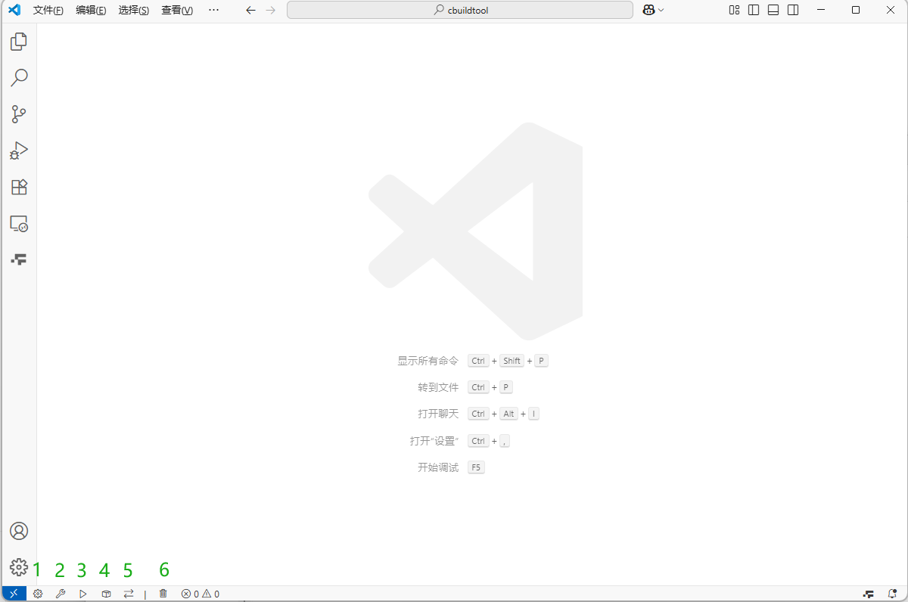

# cbuild

中文文档: [README.md](README.md)

This repository provides a lightweight build workflow for C/C++ projects, with optional VSCode integration and Conan support.

## How To Use

### Prerequisites

- python3 (required for `cb.py`)
- CMake + make/Ninja
- MSVC / gcc / clang
- Conan (optional)
- VSCode (optional)
- C/C++ extension (VSCode, optional)
- clangd + CodeLLDB (VSCode, optional)
- Task Buttons (VSCode, optional)

Environment notes:

- On Windows, it is recommended to run Bash scripts (`install.sh`, `cb.sh`) in Git Bash.
- For the Python workflow, install Python first.
- Conan is recommended to be installed via pip:

```bash
python -m pip install conan
```

### Project Bootstrap

Run the install script in your project root.

Default install (Python version, replaces `.vscode/tasks.json` with Python tasks):

```bash
# github
curl -fsSL https://github.com/wiseforever/cbuild/raw/master/install.sh | bash

# gitee
curl -fsSL https://gitee.com/wiseforever/cbuild/raw/master/install.sh | bash
```

Install Bash version (replaces `.vscode/tasks.json` with Bash tasks):

```bash
# github
curl -fsSL https://github.com/wiseforever/cbuild/raw/master/install.sh | bash -s sh

# gitee
curl -fsSL https://gitee.com/wiseforever/cbuild/raw/master/install.sh | bash -s sh
```

Only pull `.clang-format`:

```bash
# github
curl -fsSL https://github.com/wiseforever/cbuild/raw/master/install.sh | bash -s format

# gitee
curl -fsSL https://gitee.com/wiseforever/cbuild/raw/master/install.sh | bash -s format
```

Notes:

- It is recommended to clean existing `.vscode` content before running `install.sh`.
- If you do not use VSCode, only `cb.py` or `cb.sh` plus `cb_conf.ini` is required.
- Task templates are split into `.vscode/tasks_python.json` and `.vscode/tasks_bash.json`; install will copy one of them to `tasks.json`.

### `cb.py` / `cb.sh`

Both scripts depend on `cb_conf.ini` in the same directory.

#### Regarding `CMAKE_C_COMPILER` / `CMAKE_CXX_COMPILER`

`cb.py` and `cb.sh` now behave as follows:

- If `c_compiler` / `cpp_compiler` in `cb_conf.ini` is **empty**: no `-DCMAKE_C_COMPILER` / `-DCMAKE_CXX_COMPILER` is injected; CMake uses the normal environment.
- If `c_compiler` / `cpp_compiler` is **configured**:
  - `-DCMAKE_C_COMPILER=...` / `-DCMAKE_CXX_COMPILER=...` is injected automatically.
  - For absolute (or path-like) values, the compiler directory is temporarily prepended to `PATH` for this CMake subprocess only.
  - For command names like `gcc`/`g++`/`clang`/`clang++`, the script first resolves the executable path, then temporarily prepends that directory to `PATH`.
- In `MSVC` mode (`[msvc] enable=1` with valid `msvc_env_script`), behavior stays unchanged: environment is initialized via `vcvarsall.bat`, without the above injection flow.

Note: this temporary `PATH` change is process-local and does not modify user/system persistent environment variables.


#### Parameter description of cb_conf.ini


All the parameters in cb_conf.ini can be modified reasonably by yourself. The following is the description of the parameters:

```ini
[build]
build_type = Debug      # The compilation type is Debug. Currently, [Debug, Release]
source_dir = .          # The source code directory, "."indicates the current directory
generator = Ninja       # Build tools available: [Ninja, Unix Makefiles...]
parallel_jobs = auto    # The number of threads for parallel compilation, where auto means the number of cpu cores is automatically selected

[compiler]              # Compact-related configuration (excluding MSVC), is invalid if the enable of msvc takes effect (the msvc item is invalid under linux).
c_compiler = gcc        # C compiler (name or path); if non-empty, injects CMAKE_C_COMPILER
cpp_compiler = g++      # C++ compiler (name or path); if non-empty, injects CMAKE_CXX_COMPILER
conan_enable = 1        # Whether to use conan: 1, True, true indicates usage; 0, False, false indicates non-usage.
conan_build = gcc       # The profile corresponding to conan's profile build
conan_host = gcc        # The profile corresponding to conan's profile host

[msvc]                  # The msvc compiler is rather special and requires specifying the path of the environment variable script vcvarsall.bat
enable = 1              # Whether to use the MSVC compiler or not, 1, True, true indicates usage, and 0, False, false indicates non-usage
msvc_env_script = D:/Develop/Visual Studio/2019/BuildTools/VC/Auxiliary/Build/vcvarsall.bat # MSVC environment variable script path
host_arch = x64         # The number of bits for compiling the executable program can be selected as [x86, x64]
conan_enable = 1        # Whether to use conan: 1, True, true indicates usage; 0, False, false indicates non-usage.
conan_build = default   # The profile corresponding to conan's profile build , It does not take effect when there is no conanfile.txt or conanfile.py
conan_host = default    # The profile corresponding to conan's profile host , It does not take effect when there is no conanfile.txt or conanfile.py

```

#### Command instructions for using cb.py/cb.sh

Python examples:

```bash
python cb.py -t
python cb.py --conan
python cb.py -g
python cb.py -b --target all
python cb.py -c
python cb.py -r
python cb.py -h
```

Bash examples:

```bash
bash cb.sh -t
bash cb.sh --conan
bash cb.sh -g
bash cb.sh -b --target all
bash cb.sh -c
bash cb.sh -r
bash cb.sh -h
```

### vscode configuration
The.vscode directory has been configured according to the author's habits and can be modified by yourself.



As shown in buttons 1 to 5 in the above figure, they respectively correspond to generation

- 1.cmake generate;
- 2.compiling;
- 3.running
- 4.deploy (Here, you need to define a "deploy" target in your CMakeLists.txt according to your project requirements. If not necessary, please ignore it.);
- 5.Switch between Debug and Release compilation types;
- 6.clean.

You can also use the commands in the command description in cb.py/cb.sh in the terminal, or use the Task Buttons plugin in vscode. After configuring the shortcut keys, you can quickly compile and run.

### Conan Usage

- Create `conanfile.py` or `conanfile.txt` in the project root.
- Enable Conan in `cb_conf.ini` (`conan_enable = 1`).
- Set `conan_build` / `conan_host` profiles in `cb_conf.ini`.
- Use `find_package()` and `target_link_libraries()` in `CMakeLists.txt`.
- Do not override `CMAKE_TOOLCHAIN_FILE` manually when using this workflow.

#### `conanfile.py` example

```python
from conan import ConanFile
from conan.tools.files import copy
import os

class MyProjectConan(ConanFile):
    settings = "os", "compiler", "build_type", "arch"
    generators = "CMakeToolchain", "CMakeDeps"

    def requirements(self):
        self.requires("boost/1.84.0", options={"header_only": True})
        self.requires("jsoncpp/1.9.5", options={"shared": False})

    def layout(self):
        self.folders.build = ""
        self.folders.generators = os.path.join(self.folders.build, "generators")
        self.cpp.build.bindirs = ["bin"]
        self.cpp.build.libdirs = ["lib"]

    def generate(self):
        build_bin = os.path.join(self.build_folder, "bin")
        os.makedirs(build_bin, exist_ok=True)
        for dep in self.dependencies.values():
            for shared_lib in dep.cpp_info.bindirs:
                copy(self, "*.dll", shared_lib, build_bin)
                copy(self, "*.so", shared_lib, build_bin)
                copy(self, "*.dylib", shared_lib, build_bin)
```
